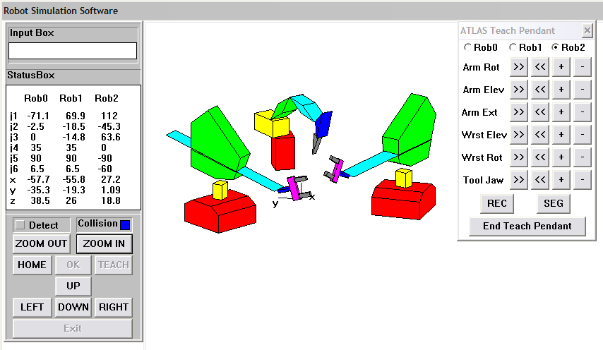

  

# This Robotics Simulator is older than the first Nvidia GPU. Now you can Vibe-Port it

# About
I developed this application as part of my MS thesis work in Artificial Intelligence and Robotics in 1994-1995. The title of my thesis was: Collision-free and deadlock-free trajectory planning for a multiple robotic arm environment using a swept-volume approach. 

This application is an object oriented 3D graphical simulator for multiple robotic arms, originally developed using Borland C++ 4.x, and targeting Windows 3.x. Some of the features of the application are:
- Kinematics simulation for robotic arms (2 different arms are included, and up to 3 can be simulated)
- 3D rendering and animation (using 3D projections of convex solids, hidden surface removal by sorting visible facets from back to front, and drawing them using polygon-fill commands)
- Changing the camera position (e.g., rotating the scene and zooming)
- Voxel based 3D swept volume computation and collision detection
- A hierarchy of algorithms for online collision detection
- Ability to control the robot using a teach-pendant UI interface
- Ability to program trajectories for the robots programmatically using textual input, and also through the teach-pendant tool; saving and replaying the programs
- A collision-free and deadlock-free algorithm to coordinate the motions of the multi-robots along their programmed trajectories by injecting wait and synchronization commands

The application is purely geometric and there is no physics/dynamics simulation.

The application code is quite nicely documented.

I can still run the application on an early 2000’s Windows PC. This requires DLL and resource files from the 90’s. The API used for handling UI events and drawing the scene is also Borland C++ 4.x API.

Developing this application was a pure delight, as geometry was my most favorite area of math, and through this project I had given myself an opportunity to put my knowledge in 2D and 3D geometry, trigonometry, and linear algebra, to use. 

I am open sourcing this project after 3 decades. I hope it works as perhaps an educational example of how, before the advent of GPUs, a 3D graphical simulation application could be developed using matrix multiplications and polygon-fill commands and nothing else. 

# Here’s a challenge for the Vibe Coders out there

30 years later, and thanks to GPUs, Deep Learning, AI, and LLMs, one may be able to quickly port an application like this to a new platform, through vibe coding!

So, given only the source files of this project, here’s the vibe coding challenge:
- Choose a target platform for porting the application to
- Reconstruct the UI elements for that platform, based on existing code that handles UI events
- Replace API calls for rendering the UI and handling UI events
- Replace low-level processing and rendering of geometry with equivalent modern GL code
- Have the coding agent analyze the code and document how you can specify or record a sequence of movements for each robotic arm, save them, and then generate collision-free and deadlock-free trajectories for them.
- Perhaps turn this into a web application!

Happy exploring the capabilities of your AI coding agents!
